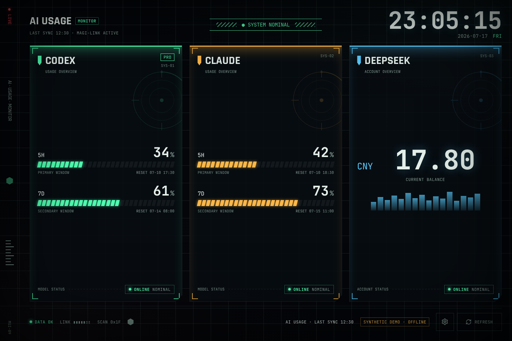

# AI Usage Dashboard

[](https://github.com/neyham/ai-usage-dashboard/actions/workflows/ci.yml)

A local-first Windows dashboard and screensaver for viewing Claude Code and
Codex usage limits alongside a DeepSeek API balance. The desktop application is
built with Tauri, Rust, React, and TypeScript.



> The screenshot uses synthetic test data. It contains no account information or
> provider credentials.

## What it shows

- Claude five-hour and seven-day utilization, reset times, cooldowns, and cache
  state.
- Codex five-hour and seven-day utilization, reset times, and plan label.
- DeepSeek API balance and insufficient-balance state.
- A combined health state that distinguishes fresh data, partial degradation,
  total failure, and an in-progress refresh.
- Normal window, borderless fullscreen, scheduled idle, and Windows
  screensaver launch modes.

Each provider is checked independently. A missing credential or an outage for
one provider does not erase last-known-good data for the other providers.

## Project status

Version `0.3.0` is an uncommitted OpenAI Build Week release candidate. It adds
provider selection and an isolated Judge Demo to the published Windows-first
`0.2.0` foundation. The responsive UI, native build, and installer flow are
exercised on Windows 11 and Surface-sized viewports. Published and candidate
installers are not code-signed, so Windows SmartScreen may require explicit
confirmation before installation.

This project reads credential formats and usage endpoints used by provider CLI
tools. Some of those interfaces are undocumented and can change without notice.
The project is not affiliated with, endorsed by, or supported by Anthropic,
OpenAI, or DeepSeek.

## OpenAI Build Week Extension

This entry is an extension of an existing open-source project, not a claim that
the entire application was created during Build Week.

**Before the event:** AI Usage Dashboard already had the Tauri/Rust/React
desktop architecture, Claude/Codex/DeepSeek integrations, sanitized IPC,
last-known-good caching, failure states, fullscreen and screensaver modes,
Surface-responsive UI, automated tests, and a public `0.2.0` Windows release.
The Codex single-window response compatibility fix also predates this extension.

**Built on 2026-07-17 with Codex and GPT-5.6:** the end-to-end provider-selection
workflow, atomic persistence, disabled-provider refresh isolation, retained
caches, zero/one/two/three-panel layouts, concurrency-safe preference changes,
expanded Surface validation, isolated Judge Demo, NSIS demo shortcut, and Build
Week judging documentation.

## Privacy and security

The Rust backend owns credentials and network requests. The React renderer only
receives a sanitized summary containing percentages, reset times, plan labels,
balances, timestamps, and status text.

- No project server, analytics, or telemetry is used.
- Provider tokens, API keys, credential files, and raw API error bodies are not
  sent to the renderer.
- DeepSeek keys are never written to the cache. Windows Credential Manager is
  preferred over environment variables and plaintext configuration.
- `%LOCALAPPDATA%\AiUsageDashboard\state.json` stores sanitized usage and
  balance data for graceful degradation. It can still contain private account
  information and should be treated as sensitive.
- Malformed configuration and invalid mock modes fail closed and do not contact
  live provider services.

See [SECURITY.md](SECURITY.md) before reporting a vulnerability or suspected
credential exposure.

## Install

### Build Week judge candidate

The `0.3.0` NSIS candidate is ready for direct installation; no source build,
Node.js, Rust, provider login, or API key is required for judging.

**Public candidate installer:** `[ADD PUBLIC v0.3.0 NSIS URL BEFORE SUBMISSION]`

After installation, open **AI Usage Dashboard (Judge Demo)** from the Windows
Start menu. The shortcut launches bundled synthetic data and is the recommended
evaluation path.

### Stable public release

Download the latest Windows installer from
[GitHub Releases](https://github.com/neyham/ai-usage-dashboard/releases/latest):

- The NSIS `setup.exe` installs for the current user and is the simplest option.
- The MSI package is available for environments that prefer Windows Installer.
- Verify the downloaded file against `SHA256SUMS.txt` attached to the same
  release before running it.

These installers are built from this repository but are currently unsigned.
Review the source and release checksums before accepting a SmartScreen prompt.
The WinGet package is planned but should not be considered available until its
manifest is accepted into `microsoft/winget-pkgs`.

## Judge Demo

Judge Demo reuses the existing production mock parsers and embedded fixtures,
but adds a dedicated safety boundary around them:

- it starts with `--judge-demo` and displays `SYNTHETIC DEMO · OFFLINE`;
- it does not load normal `config.json`, provider credentials, or the normal
  cache;
- refresh actions always regenerate embedded fixture data and never construct a
  live provider request;
- provider selections persist separately in
  `%APPDATA%\AiUsageDashboard\judge-demo.json` and cannot alter live settings;
- settings can exercise all zero, one, two, and three-panel layouts.

The demo validates the UI, selection workflow, parser-to-renderer boundary,
status presentation, and responsive layouts. It intentionally does not validate
provider authentication, endpoint availability, or the accuracy of live quota
data.

Command-line fallback for an installed current-user build:

```powershell
& "$env:LOCALAPPDATA\AI Usage Dashboard\ai-usage-dashboard.exe" --judge-demo
```

## Runtime requirements

- Windows 10 or Windows 11.
- Microsoft Edge WebView2 Runtime. It is normally present on Windows 11.

## Source build requirements

- Node.js 18 or later.
- Rust 1.88 or later with the `x86_64-pc-windows-msvc` toolchain.
- Visual Studio Build Tools with **Desktop development with C++**.

Build from Windows PowerShell, not inside WSL. A WSL build produces a Linux
binary and cannot integrate with Windows Credential Manager, Task Scheduler, or
screensaver settings. The Windows application can still read Claude credentials
from WSL through `wsl.exe`.

## Build and run

```powershell
git clone https://github.com/neyham/ai-usage-dashboard.git
cd ai-usage-dashboard
npm ci
npm run app:dev
```

Build the executable and Windows installers:

```powershell
npm run app:build
```

The main output is
`src-tauri\target\release\ai-usage-dashboard.exe`. Installer bundles are placed
under `src-tauri\target\release\bundle\`.

## Provider setup

Use the settings button in the bottom toolbar to choose which providers appear
on the home screen. Disabled providers are excluded from automatic and manual
refresh cycles, including credential reads and network requests. Changes apply
immediately and persist in `config.json`.

| Provider | Default credential source | Override |
| --- | --- | --- |
| Claude | `%USERPROFILE%\.claude\.credentials.json`, then `credentials.json`, then the same files in the `Ubuntu` WSL home | `claudeCredentialsPath` |
| Codex | `%USERPROFILE%\.codex\auth.json` | `codexAuthPath` |
| DeepSeek | Windows Credential Manager target `AiUsageDashboard/DeepSeekApiKey`, then `DEEPSEEK_API_KEY` | `deepSeekCredentialTarget` or `deepSeekApiKey` |

Sign in with the official Claude Code and Codex clients before launching the
dashboard. To store a DeepSeek key without placing it in a file, open Windows
Credential Manager, add a **Generic credential** with
`AiUsageDashboard/DeepSeekApiKey` as the network address, and enter the API key
as its password. The user-name field is not used by the application.

For a WSL distribution other than `Ubuntu`, configure an explicit Claude path
such as:

```json
{
  "claudeCredentialsPath": "wsl:Ubuntu-24.04:/home/your-user/.claude/.credentials.json"
}
```

An explicit path is fail closed. If it cannot be read, the dashboard reports an
authentication or data error instead of silently selecting another account.

### Claude token renewal

Native Windows Claude credential files are read-only to the dashboard. Direct
OAuth renewal is intentionally disabled for those files because the dashboard
cannot participate in every lock used by Claude Code. If the native token has
expired, refresh it with Claude Code or opt into the bounded CLI fallback in
configuration.

For explicit `wsl:<distro>:<absolute-path>` credentials, direct renewal uses
Claude Code-compatible lock directories, reloads the file while holding the
locks, merges only rotated OAuth fields, and writes atomically.

The optional Claude Code fallback is off by default because its recovery command
may consume a small amount of usage. When enabled, it is limited to selected
authentication failures, clamped to a maximum timeout and budget, and throttled
across dashboard processes to one attempt per 30 minutes.

## Configuration

Run the following to create or open the configuration file:

```powershell
.\src-tauri\target\release\ai-usage-dashboard.exe --config
```

The file is `%APPDATA%\AiUsageDashboard\config.json`:

```json
{
  "refreshIntervalMinutes": 5,
  "networkTimeoutSeconds": 15,
  "enabledProviders": {
    "codex": true,
    "claude": true,
    "deepseek": true
  },
  "deepSeekApiKey": "",
  "deepSeekCredentialTarget": "AiUsageDashboard/DeepSeekApiKey",
  "claudeCredentialsPath": "",
  "claudeCodeRefreshEnabled": false,
  "claudeCodeCommand": "claude",
  "claudeCodeRefreshTimeoutSeconds": 30,
  "claudeCodeRefreshMaxBudgetUsd": 0.03,
  "codexAuthPath": "",
  "mockMode": ""
}
```

Settings changed in the application apply immediately. Restart the application
after editing the JSON file directly. Timing and CLI recovery values are
clamped to safe bounds:

| Setting | Allowed range |
| --- | --- |
| `refreshIntervalMinutes` | 5 to 1,440 minutes |
| `claudeCodeRefreshTimeoutSeconds` | 5 to 120 seconds |
| `claudeCodeRefreshMaxBudgetUsd` | USD 0.001 to USD 0.10 |

Avoid `deepSeekApiKey` unless no safer storage option is available; it stores
the key as plaintext in `config.json`.

## Refresh and cache behavior

- Enabled providers refresh immediately at launch, then repeat every five
  minutes by default. Normal mode can be configured from 5 minutes to 24 hours.
- Disabled providers are not displayed, do not read credentials, and do not
  receive background or manual refresh requests. Their last-known cache remains
  available if they are enabled again later.
- Screensaver mode enforces a 15-minute minimum interval to avoid unnecessary
  idle-time traffic.
- Press `F5` or use the refresh button for an on-demand refresh in normal or
  fullscreen mode.
- Provider usage and balance requests receive one retry after transport
  failures, HTTP 408, or HTTP 5xx responses. Claude OAuth renewal is not
  automatically replayed after an ambiguous transport failure because refresh
  tokens can rotate.
- Claude HTTP 429 responses honor `Retry-After` plus a 30-second buffer. If no
  usable value is returned, the cooldown defaults to 30 minutes.
- A successful response is cached per provider. Cached data older than six
  hours is marked as possibly stale.

## Understanding status warnings

`SYSTEM NOMINAL` means every enabled provider returned fresh, healthy data.
`WARNING - SERVICE DEGRADED` means at least one enabled provider is cached,
unavailable, rate limited, unauthenticated, or reporting a non-nominal balance.
`SERVICE FAILURE` means every enabled check failed or only fallback data was
available. With no providers selected, the dashboard remains in standby.

If every enabled panel fails:

1. Confirm that Claude Code and Codex are signed in and that a DeepSeek key is
   available through one of the documented sources.
2. Open `config.json` and check for invalid JSON or an incorrect explicit path.
3. Restart after editing the JSON directly, then trigger one manual refresh.
4. Check the providers' official status pages. A provider outage should not be
   repaired by deleting credentials.
5. Use mock mode to separate a local UI problem from a credential or provider
   problem.

Deleting `%LOCALAPPDATA%\AiUsageDashboard\state.json` only clears cached display
data; it does not repair authentication.

## Launch modes

| Argument | Behavior |
| --- | --- |
| none | Normal resizable window |
| `--fullscreen` | Borderless fullscreen; `Esc` exits |
| `--judge-demo` | Isolated synthetic demo; no normal config, credential, cache, or provider access |
| `/s` or `-s` | Fullscreen, always on top, and exits on real input after a short arming delay |
| `--config` or `/c` | Opens `config.json` and exits |
| `/p <HWND>` | Windows screensaver preview; intentionally exits without rendering |

Task Scheduler is the recommended idle-launch method:

```powershell
.\install-idle-task.ps1 -IdleMinutes 10
.\install-idle-task.ps1 -Remove
```

The script prefers an installed executable under `%LOCALAPPDATA%`, then falls
back to the release build. Use `-ExePath` when the executable lives elsewhere.

The `.scr` integration is experimental because WebView2 is not embedded in the
small Windows Settings preview pane:

```powershell
.\install-screensaver.ps1 -TimeoutSeconds 900
.\install-screensaver.ps1 -Remove
```

The installer backs up the current user's screensaver registry values and only
restores them if AI Usage Dashboard is still the selected screensaver when it is
removed.

## Tests

Install the Playwright browser once, then run the renderer and Rust suites:

```powershell
npx playwright install chromium
npm test
npm run test:rust
cargo clippy --locked --all-targets --manifest-path src-tauri/Cargo.toml -- -D warnings
```

The UI suite exercises healthy, rate-limited, partial-failure, and
insufficient-balance states across seven viewports, including Surface 200%
landscape, portrait, and half-Snap layouts. It also checks overflow, touch
targets, refresh state, keyboard behavior, screensaver input exit, isolated
Judge Demo disclosure, and zero/one/two/three-panel selection layouts.

Set `mockMode` to `normal`, `claude429`, or `failures` to exercise the embedded
provider fixtures without network access. An unknown value displays `INVALID
MOCK MODE` and remains offline. `--judge-demo` is the safer judging entrypoint
because it ignores normal configuration and cache files entirely.

## Repository layout

```text
src/                         React and TypeScript renderer
scripts/viewport-check.mjs   Playwright viewport and interaction suite
mocks/                       Embedded provider response fixtures
src-tauri/src/               Rust backend, cache, fetchers, and launch modes
src-tauri/nsis-hooks.nsh     One-click Judge Demo Start menu shortcut
docs/build-week/             Build Week submission draft and judging notes
install-idle-task.ps1        Scheduled idle-mode install and removal
install-screensaver.ps1      Experimental .scr install and safe restoration
```

## License

AI Usage Dashboard is licensed under the [MIT License](LICENSE). Embedded font
software keeps its separate OFL-1.1 terms; see
[THIRD_PARTY_NOTICES.md](THIRD_PARTY_NOTICES.md).
