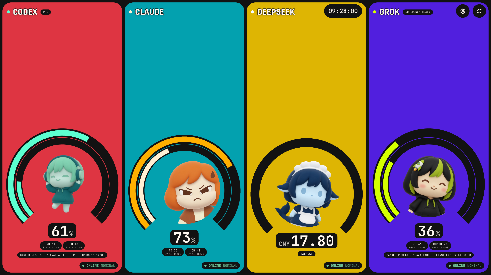
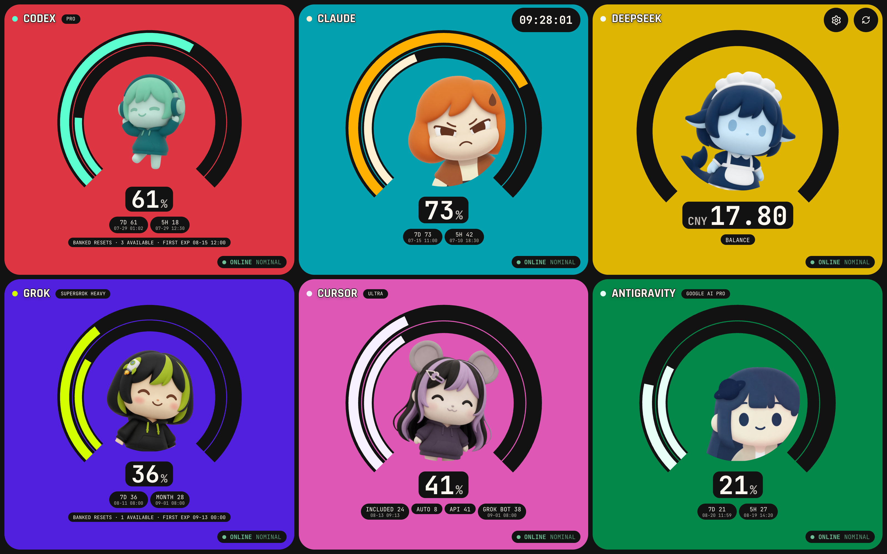
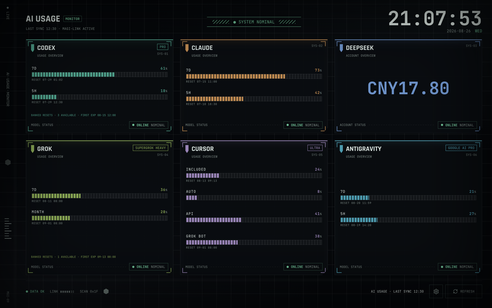

# AI Usage Dashboard

[](https://github.com/neyham/ai-usage-dashboard/releases/latest)
[](https://github.com/neyham/ai-usage-dashboard/actions/workflows/ci.yml)
[](LICENSE)

[简体中文](docs/README.zh-CN.md)

**Know your coding-agent limits before they interrupt your session.**

See Claude Code, Codex, Grok Build, Cursor, and Antigravity Gemini usage
windows, reset times, and service health—plus your DeepSeek API balance—in one
local desktop view.

**Windows · macOS · Linux · No dashboard account · No analytics or telemetry**







> Production UI rendered with bundled synthetic fixtures. No account information
> or provider credentials are shown.

AI Usage Dashboard is a current-status quota cockpit for individual developers,
not a historical cost analyzer or team FinOps service.

## Install

Download installers and SHA-256 checksums from the
[latest release](https://github.com/neyham/ai-usage-dashboard/releases/latest),
or install from the command line.

**Windows**

```powershell
winget install --id neyham.AIUsageDashboard --exact --source winget
```

**macOS**

```sh
curl -fsSL https://github.com/neyham/ai-usage-dashboard/releases/latest/download/install-macos.sh | sh
```

**Linux** — Debian/Ubuntu `.deb`, otherwise AppImage

```sh
curl -fsSL https://github.com/neyham/ai-usage-dashboard/releases/latest/download/install-linux.sh | sh
```

The macOS and Linux scripts verify downloaded assets against the published
SHA-256 file. Published installers are currently unsigned, so Windows SmartScreen
or macOS Gatekeeper may require manual confirmation.

## At a glance

| Provider | What the dashboard shows |
| --- | --- |
| Claude Code | Available usage windows, reset times, extra usage, cooldown, and cache state |
| Codex | Usage windows, reset times, plan, banked resets, and earliest expiry |
| Grok Build | Server-reported credit period, reset time, plan, optional monthly allowance, and banked usage-limit resets when available |
| Cursor | Included, Auto, named-model API usage, Grok Bot quota, plan, and billing-cycle reset |
| Antigravity | Gemini 5-hour and 7-day quota, reset times, and Google AI plan |
| DeepSeek | API balance and insufficient-balance state |

- Each provider refreshes independently; one outage does not erase the others.
- Last-known-good data stays visible and is marked when it may be stale.
- Choose any zero-to-six provider layout. Two panels sit side by side;
  three use a T (full-width top card, two below); four panels use a 2×2
  of landscape cards. Five panels fill the board; a single top-tier plan
  (SuperGrok Heavy, Cursor Ultra/Enterprise, or Google AI Ultra) occupies
  the left half; two top-tier plans split the top row.
- The default skin is IP color slabs. Compact cards keep the dual ring;
  wide top-tier cards use labeled bars. Display Settings can switch to the
  classic EVA segmented-bar HUD (no mascots). The choice is saved as
  `artSkin` in `config.json`.
- Use a normal window or borderless fullscreen on every platform.
- Enable Low Power Mode to stop animation and heavy compositing, update the
  clock once per minute, and use a 15-minute automatic-refresh minimum.
- Windows additionally supports scheduled idle launch and screensaver mode.

## Compatibility and limitations

Version `0.8.2` is the current multi-platform release: Windows (WinGet + NSIS),
Linux (`.deb` / AppImage), and macOS (`.dmg`). Screensaver and scheduled-idle
helpers remain Windows-only. Published installers are not code-signed. Community
WinGet indexes can lag a new GitHub release until the version manifest is
reviewed.

This project reads credential formats and usage endpoints used by provider CLI
tools. Some of those interfaces are undocumented and can change without notice;
incompatible responses fail closed to sanitized last-known-good data. This
project is not affiliated with, endorsed by, or supported by Anthropic, OpenAI,
xAI, Cursor, Antigravity, or DeepSeek.

## Local by design

The Rust backend owns credentials and live network requests. The React renderer
only receives sanitized percentages, reset times, plan labels, balances,
timestamps, and status text.

- There is no project account, project-operated server, analytics, or telemetry.
- Stored tokens, API keys, credential files, and raw provider responses are
  never returned to the renderer.
- A DeepSeek key entered in Settings is stored in the per-user `config.json`,
  never in the usage cache, and is not shown again by the UI. macOS and Linux
  config files use mode 0600.
- Sanitized cached summaries can still contain private account information and
  should be treated as sensitive.
- Malformed configuration and invalid mock modes fail closed.

"Local-first" does not mean live mode is offline: enabled providers are queried
directly from the Rust backend. See the full [security model](SECURITY.md) before
reporting a vulnerability or suspected credential exposure.

## Additional installation notes

Pin a version with `VERSION=0.8.2` before the install script, for example
`VERSION=0.8.2 sh install-linux.sh`.

### Windows (WinGet and direct installer)

The package is live in WinGet as `neyham.AIUsageDashboard`. After a new GitHub
release, community-source indexes can lag briefly while the version manifest is
reviewed and propagated:

```powershell
winget source update
winget show --id neyham.AIUsageDashboard --exact --source winget
```

After installation, open **AI Usage Dashboard (Judge Demo)** from the Start
menu for an offline walkthrough with synthetic data.

### Linux and macOS

The one-line scripts pull `.deb` / AppImage or `.dmg` assets from GitHub
Releases and verify checksums. Direct downloads remain available on the
[latest release](https://github.com/neyham/ai-usage-dashboard/releases/latest)
page.

## Run without credentials

The isolated offline demo reuses the production parsers and bundled fixtures:

- launch with `--judge-demo` (Start menu shortcut: **AI Usage Dashboard (Judge
  Demo)**); the UI shows `SYNTHETIC DEMO · OFFLINE`;
- it does not load normal `config.json`, credentials, cache, or provider
  endpoints;
- refresh actions regenerate fixture data without constructing a live request;
- provider selections persist separately in the platform config directory
  (`judge-demo.json`) and cannot alter live settings;
- settings can exercise every zero-to-six panel layout.

It demonstrates the UI and parser-to-renderer boundary without touching live
accounts. It does not validate authentication, endpoint availability, or live
quota accuracy.

Command-line fallbacks:

```powershell
# Windows (current-user install)
& "$env:LOCALAPPDATA\AI Usage Dashboard\ai-usage-dashboard.exe" --judge-demo
```

```sh
# Linux / macOS (from a local build)
./src-tauri/target/release/ai-usage-dashboard --judge-demo
```

## Runtime requirements

| Platform | Requirements |
| --- | --- |
| Windows 10/11 | WebView2 Runtime (usually present on Windows 11) |
| Linux | WebKitGTK 4.1, GTK 3 (see [packaging/linux](packaging/linux/README.md)) |
| macOS | macOS 11+ |

## Source build requirements

- Node.js 18 or later.
- Rust 1.88 or later.

**Windows:** `x86_64-pc-windows-msvc` toolchain and Visual Studio Build Tools with
**Desktop development with C++**. Build from PowerShell for Windows integration
(Task Scheduler and screensaver integration). A WSL build produces a Linux
binary instead.

**Linux (Ubuntu 24.04 example):**

```sh
sudo apt-get install -y build-essential curl wget file libssl-dev libgtk-3-dev \
  libwebkit2gtk-4.1-dev libayatana-appindicator3-dev librsvg2-dev patchelf pkg-config
```

**macOS:** Xcode Command Line Tools (`xcode-select --install`).

## Build and run

```sh
git clone https://github.com/neyham/ai-usage-dashboard.git
cd ai-usage-dashboard
npm ci
npm run app:dev
```

Build the native app and platform installers:

```sh
npm run app:build
```

Outputs land under `src-tauri/target/release/` and
`src-tauri/target/release/bundle/` (NSIS on Windows, `.deb`/AppImage on Linux,
`.dmg`/`.app` on macOS).

Do not use a standalone `cargo build` debug executable as a deployment smoke
test. Debug builds load the Vite `devUrl` (`http://localhost:1420`) and require
`npm run app:dev` to stay running. Use `npm run app:build` and the release binary
or bundle when validating embedded production assets.

## Provider setup

Use the settings button (gear) to choose the window mode, art skin, and
which providers appear on the home screen. Disabled providers are excluded from
automatic and manual refresh cycles, including credential reads and network
requests. Only changed fields are submitted; provider and window changes are
saved together, and a temporary CLI fullscreen override is not persisted by a
provider-only save. The same dialog accepts a replacement DeepSeek API key;
leave its password field blank to keep the existing value.

| Provider | Default credential source | Override |
| --- | --- | --- |
| Claude | `~/.claude/.credentials.json`, then `credentials.json` | `claudeCredentialsPath` (native file path) |
| Codex | `~/.codex/auth.json` | `codexAuthPath` (native file path) |
| DeepSeek | `deepSeekApiKey` saved from Display Settings, then `DEEPSEEK_API_KEY` | Enter or replace it in Display Settings |
| Grok Build | `~/.grok/auth.json` | `grokCredentialsPath` (native file path) |
| Cursor | Official CLI login (`~/.cursor/auth.json` on macOS, `%APPDATA%\Cursor\auth.json` on Windows, `~/.config/cursor/auth.json` on Linux; macOS Keychain) or Cursor desktop `state.vscdb` | `cursorCredentialsPath` (`auth.json` or `state.vscdb`) |
| Antigravity | Official `agy` OAuth file `~/.gemini/antigravity-cli/antigravity-oauth-token`, then the OS keyring item `agy` writes (`service=gemini`, `account=antigravity`) | `antigravityCredentialsPath` (native file path; skips the keyring) |

Sign in with the official Claude Code, Codex, Grok Build, Cursor, and
Antigravity (`agy`) clients before enabling their panels. Grok, Cursor, and
Antigravity are disabled by default so an upgrade never starts reading a newly
introduced credential source without an explicit selection. Enable Cursor from
**Display Settings** (gear) or by setting `enabledProviders.cursor` to `true`
in `config.json`.

The direct settings field stores DeepSeek's key as plaintext in the per-user
configuration file. The app never pre-fills or returns that value to the UI;
blank means unchanged. On Mac/Linux, every app config replacement is created
with mode 0600 before it becomes visible.

If you do not want the key in `config.json`, set `DEEPSEEK_API_KEY` in the app's
environment instead.

Windows reads the same native credential files as a regular Windows login.
It does not look inside WSL. An explicit path is fail closed. If it cannot be
read, the dashboard reports an authentication or data error instead of silently
selecting another account.
When a recognized Grok access token expires and the login contains a refresh
token, the dashboard runs
`grok --no-auto-update models` through the official CLI with no shell
interpolation, no captured output, and a 20-second timeout. The official CLI
silently renews its own session, after which the dashboard rereads
`auth.json`. The dashboard never extracts the refresh-token value into app
state, sends it, logs it, passes it to the child process, or writes the
credential file itself. A billing `401` can trigger the same flow once, covering
clock skew or a token rejected before its local expiry. Attempts are serialized
across dashboard processes and held per credential source for 15 minutes before
another background attempt. An unavailable CLI is shown as
`GROK SESSION EXPIRED` instead of incorrectly claiming that the credential file
is missing; a `403` is reported separately as `GROK ACCESS UNAVAILABLE`.

Cursor uses the official CLI login or the desktop app session already on the
machine. On macOS the CLI stores the access token in the login Keychain
(`cursor-access-token`); on Windows and Linux the CLI writes `auth.json`. The
desktop app keeps a session token in `state.vscdb`. The dashboard only reads
the access token, builds a session cookie for `cursor.com/api/usage-summary`,
and never extracts a refresh token, writes credential files, or asks the
official Cursor CLI to renew. The same token also queries
`GetSandUsageStatus` for Grok Bot quota on the Cursor card; a missing Bot
response does not fail Included / Auto / API. An expired session is reported as
`SESSION EXPIRED`. These are not public APIs; incompatible responses fail
closed to sanitized last-known-good data.

Antigravity uses the official `agy` OAuth file at
`~/.gemini/antigravity-cli/antigravity-oauth-token`. Current `agy` builds store
the same JSON in the OS keyring instead of that file; the dashboard then reads
the `gemini` / `antigravity` item from macOS Keychain, GNOME Keyring, or
Windows Credential Manager. If the access token is expired, the dashboard may refresh it in memory through
Google's token endpoint. It does not embed Google OAuth client secrets. The
client is taken from `ANTIGRAVITY_OAUTH_CLIENT_ID` /
`ANTIGRAVITY_OAUTH_CLIENT_SECRET`, from `client_id`/`client_secret` on the local
login JSON, or by scanning an installed `agy` / Antigravity.app (the same
discovery CodexBar uses). If none are found, the panel shows `SESSION EXPIRED`
until you run `agy`, which refreshes the OS login. It never writes the file or
keyring item, never sends the refresh token to the renderer, and never logs
credentials. Quota comes
from `retrieveUserQuotaSummary`. These are not public APIs; incompatible
responses fail closed to sanitized last-known-good data.

CodexBar's Grok adapter informed the credential boundary, official-CLI renewal,
and provider selection. Grok Build 0.2.111 currently returns `Method not found`
for its `x.ai/billing` ACP probe, so this dashboard uses the live-verified
read-only JSON billing responses that include an explicit period type and Grok
Build product usage. These are not public APIs; incompatible responses fail
closed to sanitized last-known-good data.

### Claude token renewal

Claude credential files are read-only to the dashboard. Direct OAuth renewal is
intentionally disabled because the dashboard cannot participate in every lock
used by Claude Code. If the token has expired, refresh it with Claude Code or
opt into the bounded CLI fallback in configuration.

The optional Claude Code fallback is off by default because its recovery command
may consume a small amount of usage. When enabled, it is limited to selected
authentication failures, clamped to a maximum timeout and budget, and throttled
across dashboard processes to one attempt per 30 minutes.

## Configuration

Run the following to create or open the configuration file:

```sh
# Linux / macOS
./src-tauri/target/release/ai-usage-dashboard --config

# Windows
.\src-tauri\target\release\ai-usage-dashboard.exe --config
```

Config path by platform:

| Platform | Path |
| --- | --- |
| Windows | `%APPDATA%\AiUsageDashboard\config.json` |
| Linux | `~/.config/AiUsageDashboard/config.json` |
| macOS | `~/Library/Application Support/AiUsageDashboard/config.json` |

Example:

```json
{
  "refreshIntervalMinutes": 5,
  "networkTimeoutSeconds": 15,
  "enabledProviders": {
    "codex": true,
    "claude": true,
    "deepseek": true,
    "grok": false,
    "cursor": false,
    "antigravity": false
  },
  "deepSeekApiKey": "",
  "claudeCredentialsPath": "",
  "claudeCodeRefreshEnabled": false,
  "claudeCodeCommand": "claude",
  "claudeCodeRefreshTimeoutSeconds": 30,
  "claudeCodeRefreshMaxBudgetUsd": 0.03,
  "codexAuthPath": "",
  "grokCredentialsPath": "",
  "cursorCredentialsPath": "",
  "antigravityCredentialsPath": "",
  "mockMode": "",
  "windowMode": "normal",
  "lowPowerMode": false,
  "artSkin": "ip"
}
```

Settings changed in the application apply immediately. Restart the application
after editing the JSON file directly. Timing and CLI recovery values are
clamped to safe bounds:

| Setting | Allowed range |
| --- | --- |
| `refreshIntervalMinutes` | 5 to 1,440 minutes |
| `claudeCodeRefreshTimeoutSeconds` | 5 to 120 seconds |
| `claudeCodeRefreshMaxBudgetUsd` | USD 0.001 to USD 0.10 |

`artSkin` is `"ip"` (color slabs, default) or `"ring"` (classic EVA bars).
Change it from **Display Settings**.

`lowPowerMode` can also be changed from **Display Settings**. It disables
continuous motion and heavyweight full-screen overlays, removes decorative
glows, updates the clock once per minute, and applies a 15-minute minimum to
automatic provider refreshes. Manual refresh remains available. Hidden or
minimized windows pause motion and clock updates automatically in either mode.

`deepSeekApiKey` is plaintext in `config.json`. Treat that per-user file as a
secret and do not sync or commit it. The settings UI never displays the saved
value again.

## Refresh and cache behavior

- Enabled providers refresh immediately at launch, then repeat every five
  minutes by default. Normal mode can be configured from 5 minutes to 24 hours.
- Disabled providers are not displayed, do not read credentials, and do not
  receive background or manual refresh requests. Their last-known cache remains
  available if they are enabled again later.
- Screensaver mode enforces a 15-minute minimum interval to avoid unnecessary
  idle-time traffic.
- Low-power mode enforces the same 15-minute minimum while it is enabled. The
  change is applied immediately without triggering an extra provider request.
- Press `F5` or use the refresh button for an on-demand refresh in normal or
  fullscreen mode.
- Provider usage and balance requests receive one retry after transport
  failures, HTTP 408, or HTTP 5xx responses. Claude OAuth renewal is not
  automatically replayed after an ambiguous transport failure because refresh
  tokens can rotate.
- Claude HTTP 429 responses honor `Retry-After` plus a 30-second buffer. If no
  usable value is returned, the cooldown defaults to 30 minutes.
- Codex, DeepSeek, and Grok HTTP 429 responses use the same bounded cooldown and
  persist it in `state.json`, preventing manual refreshes from bypassing the
  provider's `Retry-After` deadline.
- A successful response is cached per provider. Cached data older than six
  hours is marked as possibly stale.

## Understanding status warnings

`SYSTEM NOMINAL` means every enabled provider returned fresh, healthy data.
`WARNING - SERVICE DEGRADED` means at least one enabled provider is cached,
unavailable, rate limited, unauthenticated, or reporting a non-nominal balance.
`SERVICE FAILURE` means every enabled check failed or only fallback data was
available. With no providers selected, the dashboard remains in standby.

Panel status text distinguishes setup and auth from generic failures when
possible: DeepSeek uses `KEY MISSING` / `AUTH EXPIRED` / `AUTH FORBIDDEN`
instead of a blanket `API ERROR` when the key is absent or rejected; Codex and
Claude use `LOGIN REQUIRED` / `AUTH EXPIRED` (and related auth statuses), while
a malformed or unreadable Codex credential file is `CREDENTIAL ERROR`; Grok
keeps `GROK SESSION EXPIRED` for expired sessions. `API ERROR` still means a
transport, HTTP, or response-parse failure after credentials were available.

If every enabled panel fails:

1. Confirm that Claude Code, Codex, and any enabled Grok Build or Cursor provider are
   signed in and that a DeepSeek key is available through one of the documented
   sources.
2. Open `config.json` and check for invalid JSON or an incorrect explicit path.
3. Restart after editing the JSON directly, then trigger one manual refresh.
4. Check the providers' official status pages. A provider outage should not be
   repaired by deleting credentials.
5. Use mock mode to separate a local UI problem from a credential or provider
   problem.

Deleting `%LOCALAPPDATA%\AiUsageDashboard\state.json` only clears cached display
data; it does not repair authentication.

## Launch modes

Default chrome follows `windowMode` in `config.json` (`normal` or `fullscreen`).
Change it from **Display Settings** in the app (gear icon), or by editing the
config file and restarting. CLI flags still override the saved preference for
that process.

| Argument | Behavior |
| --- | --- |
| none | Uses saved `windowMode` (`normal` by default) |
| `--fullscreen` | Borderless fullscreen; `Esc` exits |
| `--judge-demo` | Offline synthetic demo; no normal config, credential, cache, or provider access |
| `/s` or `-s` | Fullscreen, always on top, and exits on real input after a short arming delay |
| `--config` or `/c` | Opens `config.json` and exits |
| `/p <HWND>` | Windows screensaver preview; intentionally exits without rendering |

Task Scheduler is the recommended idle-launch method:

```powershell
.\install-idle-task.ps1 -IdleMinutes 10
.\install-idle-task.ps1 -Remove
```

The script prefers an installed executable under `%LOCALAPPDATA%`, then falls
back to the release build. Use `-ExePath` when the executable lives elsewhere.

The `.scr` integration is experimental because WebView2 is not embedded in the
small Windows Settings preview pane:

```powershell
.\install-screensaver.ps1 -TimeoutSeconds 900
.\install-screensaver.ps1 -Remove
```

The installer backs up the current user's screensaver registry values and only
restores them if AI Usage Dashboard is still the selected screensaver when it is
removed.

## Tests

Install the Playwright browser once, then run the renderer and Rust suites:

```powershell
npx playwright install chromium
npm test
npm run test:rust
cargo clippy --locked --all-targets --manifest-path src-tauri/Cargo.toml -- -D warnings
```

The UI suite exercises healthy, rate-limited, partial-failure, and
insufficient-balance states across seven viewports, including Surface 200%
landscape, portrait, and half-Snap layouts. It also checks overflow, touch
targets, refresh state, keyboard behavior, screensaver input exit, offline demo
disclosure, zero-to-six panel selection layouts, plan-tier large and small
cards, transactional settings failures, CLI fullscreen isolation, modal focus
behavior, and auth-chip mapping.

Set `mockMode` to `normal`, `claude429`, or `failures` to exercise the embedded
provider fixtures without network access. An unknown value displays `INVALID
MOCK MODE` and remains offline. `--judge-demo` is the safer offline entrypoint
because it ignores normal configuration and cache files entirely.

## Repository layout

```text
src/                         React and TypeScript renderer
scripts/viewport-check.mjs   Playwright viewport and interaction suite
mocks/                       Embedded provider response fixtures
src-tauri/src/               Rust backend, cache, fetchers, and launch modes
src-tauri/nsis-hooks.nsh     Offline demo Start menu shortcut
docs/releases/               Per-release notes
install-idle-task.ps1        Scheduled idle-mode install and removal
install-screensaver.ps1      Experimental .scr install and safe restoration
```

## License

AI Usage Dashboard is licensed under the [MIT License](LICENSE). Embedded font
software keeps its separate OFL-1.1 terms; see
[THIRD_PARTY_NOTICES.md](THIRD_PARTY_NOTICES.md).
