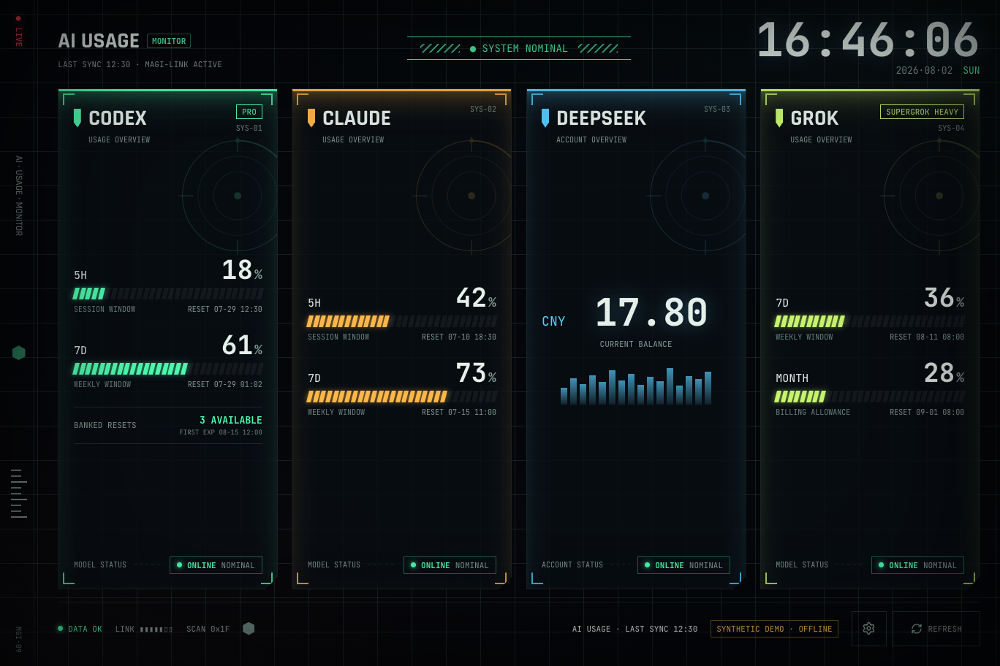

# AI Usage Dashboard

[English](../README.md)

把 Claude Code、Codex、Grok Build 的当前额度窗口与重置时间，以及
DeepSeek API 余额，集中放在一个本地桌面看板里。

**Windows · macOS · Linux · 无看板账号 · 无 analytics 或 telemetry**



> 图片来自正式 UI 和内置合成数据，不包含真实账号信息或 provider credential。

它面向同时使用多个 AI coding 工具的个人开发者，用于查看当前状态；它不是历史
成本分析、团队账单或 FinOps 服务。

## 可以查看什么

| Provider | 显示内容 |
| --- | --- |
| Claude Code | 可用额度窗口、重置时间、extra usage、cooldown 和缓存状态 |
| Codex | 额度窗口、重置时间、套餐、banked resets 及最早到期时间 |
| Grok Build | 服务端返回的 credit period、重置时间、套餐和可选月度 allowance |
| DeepSeek | API 余额和余额不足状态 |

- 四个 provider 独立刷新；其中一个失败不会清空其他面板。
- 可以自由选择 0–4 个面板。
- 三个平台均支持普通窗口和无边框全屏。
- Windows 另外支持 WSL credential discovery、闲置启动和屏保模式。

## 安装

也可以直接前往 [最新 Release](https://github.com/neyham/ai-usage-dashboard/releases/latest)
下载安装包和 SHA-256 校验文件。

### Windows

```powershell
winget install --id neyham.AIUsageDashboard --exact --source winget
```

### macOS

```sh
curl -fsSL https://github.com/neyham/ai-usage-dashboard/releases/latest/download/install-macos.sh | sh
```

### Linux

Debian/Ubuntu 安装 `.deb`，其他发行版使用 AppImage：

```sh
curl -fsSL https://github.com/neyham/ai-usage-dashboard/releases/latest/download/install-linux.sh | sh
```

macOS 和 Linux 安装脚本会根据 Release 中发布的 SHA-256 文件校验下载内容。
当前安装包尚未代码签名，因此 Windows SmartScreen 或 macOS Gatekeeper 可能要求
手工确认。

## 本地优先与安全边界

- credential 和 live provider 请求由 Rust 后端处理。
- React renderer 只接收脱敏后的比例、重置时间、套餐、余额、时间戳和状态文字。
- 项目不运行中转服务器，不要求注册账号，也没有 analytics 或 telemetry。
- “本地优先”不等于 live mode 完全离线：启用 provider 后，Rust 后端仍会直接请求
  provider endpoint。
- 在 Settings 中填写的 DeepSeek key 会保存到当前用户的 `config.json`，不会写入
  usage cache，也不会再次显示在 UI 中。macOS/Linux 配置文件使用 0600 权限。

完整说明见 [SECURITY.md](../SECURITY.md)。

## 不读取 credential 的离线演示

使用 `--judge-demo` 可以启动隔离的合成数据演示。它不会读取正常配置、credential、
cache，也不会构造 provider 网络请求；设置中仍可体验 0–4 面板布局。

Windows 安装包目前会添加 **AI Usage Dashboard (Judge Demo)** 开始菜单快捷方式。

## 兼容性与限制

- 当前版本为 `v0.5.0`：Windows、Linux、macOS。
- 屏保和闲置启动工具仅支持 Windows。
- 项目使用 provider CLI 的 credential 格式和用量 endpoint，其中一部分不是公开
  API，未来可能变化。
- DeepSeek 面板显示 API balance，不是聊天产品的 token usage。
- 本项目与 Anthropic、OpenAI、xAI、DeepSeek 没有隶属、背书或官方合作关系。

源代码构建、provider 配置、刷新与缓存行为等完整技术说明请继续阅读
[英文 README](../README.md)。
